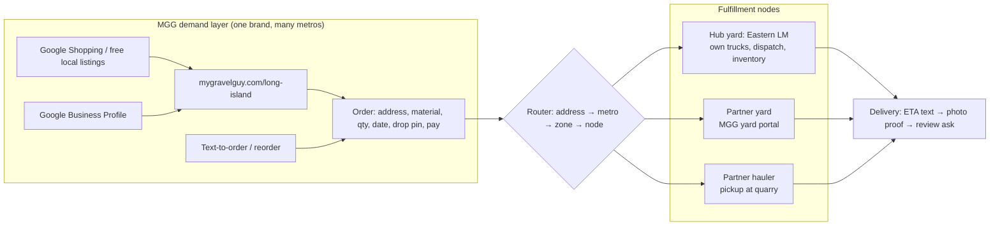
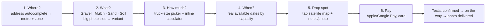

# MyGravelGuy Metro Strategy — Network, Fulfillment, Organic Growth, New UI

_Branch: `feature/metro-ui` · Started 2026-09-27 · Status: draft for owner review_

> **Current status (2026-09-28)** — DFW = metro #1 (owner pick); Long Island (Eastern LM) = pilot/reference metro. Metro storefront is built on this branch: routes `/dallas-fort-worth`, `/long-island`, metro × category pages, and town pages, on a tested pricing/dates engine (44/44 tests passing, `tsc`/`eslint` clean). **Nothing committed or pushed yet.** **Top objective: get cited as a reference in Google Search AI Overviews / AI Mode and Gemini — ChatGPT citations come second** (§9). Two research docs are still in progress: `docs/metro/research/dfw-pricing-v2.md` (price-book v2) and `docs/metro/research/external-llm-competitor-synthesis.md` (cross-checked competitor synthesis). Full running log: `docs/metro/HANDOFF-LOG.md`.

## 0. The one-line thesis

**Stop being "nationwide gravel" and become "the easiest way to get gravel, mulch, sand or soil dropped in your driveway" — one metro at a time, each metro backed by a real yard, real trucks and real delivery data.** We charge a premium for the simplicity, so the simplicity has to be real: instant delivered price, pick a date, drop a pin, pay, done.

Why the pivot:

| Signal | Source |
|---|---|
| MGG nationwide: 41 paid orders, 89 quotes, 218 abandoned carts, $1,473 AOV, spread over CA/FL/TX/NY/MN/NC (no metro with density) | `docs/01-business-overview.md` (Mar 2026 snapshot) |
| 196 `/locations/:city-state` pages are town-swap templates (~120 words), several redirect to `/locations` because the slug is not in the hardcoded list or Google Sheet | `content-pipeline/SESSION_REPORT.md`, `src/pages/LocationPage.tsx:229-238` |
| Fulfillment is manual: admin calls a supplier, types `supplier_charges`, no dispatch, no trucks table, no radius logic | `OrderDetailModal.tsx`, `validateZipCode.ts:23-27` |
| Eastern LM (sister yard): **3,745 deliveries, $1.40M delivered revenue** (Apr 2023 – Mar 2026), tightly clustered around one yard | ELM WooCommerce export, `scripts/analysis/elm_delivery_geo.py` |

The ELM data proves the thing MGG has not yet proven anywhere: **density around a hub**.

> **Update 2026-09-27 — owner direction: Dallas–Fort Worth is likely metro #1.** Long Island (ELM) stays the operating playbook and a pilot/reference metro: it's where the hub model is proven with real data. DFW is where MGG's own brand, ads, and demand come first, fulfilled by partner nodes. See §2A.

---

## 2A. Metro #1: Dallas–Fort Worth

### Why DFW

- Largest addressable market of MGG's current states. There is already a hardcoded Dallas location page (`src/data/locations/texas.ts`) and TX supplier records (OilFlyOne Aggregates, Texan Material, AAA Sand; see `docs/01-business-overview.md`).
- Heavy new-construction and new-homeowner volume. Clay soils drive steady demand for topsoil, fill, base and drainage rock. Year-round season (no Northeast winter shutdown), which smooths the demand curve.
- Many quarries and yards, so there's plenty of partner-node supply. Local yard UX is weak: most yards are phone-only or have basic Shopify carts.

### MGG's current DFW prices vs market (the big finding)

Live catalog check (public `products` + `service_zip_codes`, 2026-09-27): **all 242 DFW ZIPs** (Dallas, Tarrant, Collin, Denton, Rockwall, Kaufman, Ellis, Johnson counties) have `price_adjustment = 1`. That means DFW gets the national curve `a·e^(b·q)+c`:

| Product | 5 units | 10 units | 20 units |
|---|---|---|---|
| #57 crushed stone | $137/ton ($684) | $95/ton ($950) | $85/ton ($1,707) |
| Pea gravel | $206/ton ($1,030) | $142/ton ($1,418) | $126/ton ($2,514) |
| Crusher run | $145/ton | $105/ton | $91/ton |
| Mulch (any) | $140/yd ($698) | $92/yd ($920) | $80/yd ($1,610) |
| Topsoil | $118/yd | $82/yd | $64/yd |

What DFW competitors publish:

| Source | What they list |
|---|---|
| [Mulch Mound Dallas](https://mulchmound.com/products/dallas-texas-mulch-delivery) | Mulch **$46/yd**, delivery fee calculated in cart, Shopify checkout with delivery date picker; 4.7★ (137 Google reviews) per their page |
| [Outdoor Warehouse Supply](https://www.outdoorwarehousesupply.com/product-category/bulk-materials/gravel/) (Plano + Lewisville yards) | Pea gravel **$100/yd**, native gravel $100/yd, flex base $65/yd, 2 yd minimum, same/next-day delivery, online cart |
| [Silver Creek Materials](https://silvercreekmaterials.com/) (Fort Worth) | No online prices; "delivery priced by distance and volume" (phone) |
| [Gravel Monkey price guide](https://mygravelmonkey.com/blog/gravel-prices-texas/) (competitor claim, unverified) | DFW delivered: crusher run $28–38/ton, #57 $35–48/ton, pea gravel $40–55/ton, washed sand $30–42/ton |
| [Hello Gravel Dallas](https://hellogravel.com/locations/texas/dallas-75201/gravel/) (broker) | 3-ton minimum, 2+ business days standard, next-day before noon for a fee (per search snippet; page blocks fetch) |

**Read:** on a like-for-like ~10 yd or ~10 ton order, MGG is roughly **1.6–2× local yard retail + delivery**, and 2–3× the delivered per-ton figures a competitor guide claims. A premium for simplicity is right. A 60–100% premium is probably why TX shows only 6 orders at a $1,055 average. **Recommend: DFW price book = partner delivered cost × 1.25–1.40**, shown as one delivered price. Validate by A/B testing two premium levels during launch.

> **Data caveat:** the scraped DFW competitor catalog (`docs/metro/research/dfw-competitor-catalog.md`) mixes two price classes — **local yards** (Mulch Mound, Outdoor Warehouse Supply, ex-delivery or small flat fee) and **online brokers** (Gravel Monkey, My Gravel Buddy, delivery-included, small-load pricing, not DFW-specific). Blended medians skew high on stone/rock SKUs and pull mulch/topsoil medians in inconsistent directions. Cross-checked against MGG's *live* DFW prices, the catalog shows MGG is currently **at or below local-yard cost** on #57 stone/pea gravel but **already above a +35% target** on mulch/topsoil — i.e. inconsistent, not uniformly high. **Target positioning: above yard-price-plus-delivery, below online-broker price** — the same "premium for a guaranteed, dead-simple experience, not the cheapest and not the most padded" lane. Price book v2 (splitting yard vs. broker classes, quantity-normalized to a 10-unit delivered order) is in progress: `docs/metro/research/dfw-pricing-v2.md`.

### DFW competitor set (initial)

| Player | Model | Online ordering | Notes |
|---|---|---|---|
| Hello Gravel | National broker, programmatic city pages (`/locations/texas/dallas-75201/…`) | Yes, 3-ton min | Owns cost/guide SERPs nationally; the closest model to MGG |
| Gravel Monkey (mygravelmonkey.com) | Online multi-region aggregate delivery | Live ZIP pricing at checkout, `FIRSTTIMER50` promo | **Name is confusingly close to MyGravelGuy.** Publishes metro price tables (AEO bait) |
| Mulch Mound | Multi-city Shopify storefront, DFW city pages (`/pages/dallas-texas`, `/pages/addison-texas`…) | Yes, date picker, satellite mulch calculator | Mulch-led, supplier location selectable |
| Outdoor Warehouse Supply | Local yards (Plano, Lewisville) | Cart + phone | Same/next-day delivery |
| Silver Creek Materials, Soil Building Systems, Fort Worth Grass & Stone, A Better Arborist | Local yards/producers | Mostly phone | Potential **partner nodes** rather than competitors |
| HomeGuide / Angi lists | Lead-gen directories | — | Own the "best sand and gravel delivery Dallas" SERPs |

**Wedge for MGG in DFW:** the only option that combines all four of: (1) one delivered price shown before checkout, (2) a real date picker with confirmed windows, (3) the full hero range from one storefront (gravel, mulch, sand, soil), not mulch-only or stone-only, and (4) drop-pin, photo proof and texted updates. Partner with the phone-only yards (Silver Creek, Soil Building Systems, etc.) as fulfillment nodes. Their weakness online is MGG's supply.

### DFW network design

- **Nodes:** 2–3 partner yards covering the metroplex's four quadrants: north (Plano/Lewisville/Denton), west (Fort Worth), south/east (Dallas south, Mesquite, Rockwall). Each signs a zone × material wholesale-delivered price sheet and a daily load capacity.
- **Zones:** drawn by drive time from each node (not by county). Placeholder zones in code use counties until nodes are signed.
- **Units:** stone and sand in tons with a yards equivalent shown; mulch and soil in yards (matches how DFW yards sell).
- **Launch sequence:** (1) sign nodes, (2) load price book, (3) metro + category pages live with prerendered prices, (4) Google Merchant regional pricing for DFW, (5) paid test (Google Shopping + ChatGPT ads), (6) pile signs and review engine from delivery #1.

---

## 1. Order history analysis

### 1a. Eastern LM delivered orders by ring (hub: 110 Frowein Rd, Center Moriches)

Reproduce: `python scripts/analysis/elm_delivery_geo.py <path>/All_WC_Orders_Export.csv` (aggregates only, no PII).

| Ring | Towns (ELM delivery zone labels) | Orders | Revenue | Share | Avg | Median |
|---|---|---|---|---|---|---|
| Core (≤ ~8 mi) | Manorville, Center/East Moriches, Moriches, Mastic, Mastic Beach, Shirley, Eastport | 2,393 | $723,815 | 52% | $302 | $217 |
| West Hamptons | Remsenburg, Speonk, Westhampton, WHB, Quogue, East Quogue, Dune Rd | 817 | $352,839 | 25% | $432 | $314 |
| East End | Hampton Bays, Southampton, Sag Harbor, Water Mill, Riverhead, Calverton, North Fork | 233 | $160,852 | 12% | $690 | $429 |
| Brookhaven mid | Patchogue, Bellport, Brookhaven, Yaphank, Ridge, Medford, Coram | 238 | $119,691 | 9% | $503 | $371 |
| North Shore | Wading River, Shoreham, Rocky Point | 37 | $27,855 | 2% | $753 | $432 |

Stand-out zones (avg ticket): North Fork (Jamesport/Mattituck) **$1,210**, Southampton/Sag Harbor/Water Mill **$1,187**, Dune Road **$893**, Hampton Bays **$737**.

**Seasonality** (share of delivered orders by month): Mar 5% · **Apr 13% · May 23% · Jun 19%** · Jul 11% · Aug 10% · Sep 7% · Oct 6% · Nov–Feb ~6% combined. April–June = 55% of the year.

**Repeat behavior**: of delivery orders with a customer identifier, 276 repeat customers placed 858 of 1,751 orders (**49%**).

**What customers buy delivered** (top lines): topsoil, fine sand, black mulch, RCA (crushed concrete), 3/4" washed gravel, 3/4" & 3/8" bluestone, 3/8" pea gravel, clean fill, dark natural mulch, compost, whitestone. → The four hero categories (**gravel, mulch, sand, soil**) cover ~70% of bulk delivered line items; the rest is masonry/hardscape add-ons.

### 1b. Conclusions

1. **Premium demand already exists on the East End** — tickets 2–4× the core — but ELM under-penetrates it (12% of revenue). That is the customer MGG's "we make it effortless" premium is built for: second-home owners, estate/property managers, landscapers working for them.
2. **The core ring is ELM's** (walk-in + contractor + phone relationships). MGG should not fight ELM there on price; MGG sells the *experience* (instant online, scheduled windows, photo drop pin, text updates) and routes fulfillment back to ELM trucks.
3. **Capacity, not demand, is the spring constraint.** 23% of annual deliveries land in May. Pre-booking and date-based pricing (see §4) turn that into margin instead of lost orders.
4. **Half the business is repeat.** Retention mechanics (reorder, seasonal reminders, saved addresses) are worth more than new-customer ads.

### 1c. Still needed — MGG's own order history

MGG orders live in Supabase `orders` (admin-only RLS; no order CSV export exists in the app). To finish the analysis we need one of:
- an export from Supabase dashboard → `orders` table (CSV), or
- a read-only DB connection string / service key used locally only.

Planned MGG cuts: paid orders + quotes + carts by state → metro (CBSA) → ZIP; AOV/tons by metro; quote→order conversion by metro; supplier used per order and margin (`total_price − supplier_charges`); cart abandonment by ZIP price adjustment; `location_search` (ZIP searches with no order) = **latent demand map** for picking metro #2–#5.

---

## 2. Network model: hub-and-spoke metros



### Definitions

- **Metro** — a marketed area with its own URL, price book, and launch date (e.g. `long-island`). Contains zones.
- **Zone** — a set of ZIPs with the same delivery cost band (ring by drive time from the serving node). Replaces the per-ZIP `price_adjustment` multiplier for metro pricing. ELM already uses named zones (e.g. "Quogue (3 yd min)", LocalShip25/35/50/75/100…) — seed from those.
- **Fulfillment node** — a yard or hauler that can load and deliver. Has: address, hours, materials stocked, trucks (5 / 10 / 20 yd), daily load capacity, cutoff time, cost sheet.
- **Serving rule** — each zone has a primary node + backup node. Router picks the primary unless its capacity for the requested date is full.

### Metro launch checklist (a metro is "live" only when all true)

1. Anchor node with the 4 hero categories stocked and a signed price sheet (material cost + per-load delivery cost by zone).
2. Zones drawn and delivered price computed for every hero SKU × zone.
3. Daily capacity (loads/day by truck size) entered so the date picker is honest.
4. Metro page + material pages + town pages *only for towns with real deliveries*.
5. GBP / Merchant Center local setup done (see §5).
6. First 10 deliveries photographed → used on pages and for review asks.

### Metro sequencing

| # | Metro | Why | Node |
|---|---|---|---|
| 1 | **Dallas–Fort Worth** (owner pick) | Biggest market in MGG's footprint, year-round season, weak local online UX, TX suppliers already in DB | 2–3 partner yards (see §2A) |
| Pilot | **Long Island — East (Suffolk) + Hamptons** | 3,745 proven deliveries, own yard + trucks + dispatch software (ELM). The place to prove the order flow, photo proof, and review engine with zero supply risk | Eastern LM |
| 2–4 | Chosen from MGG order + `location_search` data | Candidates from Mar-2026 data: Florida (8 orders, $3,355 avg), Houston/Austin (same TX partners), Nashville & Boston (market pages exist), Twin Cities | Existing suppliers in `suppliers` table |

Rule: **no metro page goes live without a node.** Everything outside live metros gets a "Request delivery in your area" waitlist (captures demand for sequencing) or the existing quote flow.

---

## 3. Fulfillment model

### Hub metro (ELM-served)

- MGG takes the order and payment (MGG is merchant of record) → pushes an order into ELM's system (`orders` / `order_items` / `delivery_assignments` in the ELM Supabase — ELM already auto-creates one assignment per load, `src/lib/dispatch/auto-assign.ts`).
- ELM invoices MGG at wholesale-delivered rates (per zone price sheet). MGG margin = retail delivered − wholesale delivered.
- Status flows back (scheduled → out for delivery → delivered + photo) and MGG texts the customer.
- ELM's delivery fee engine (drive time × fuel/labor × multiplier, first load 100% / extra loads 75%, trucks 5/10/20 yd, mulch capacity 7/10/20) is already built and tested — **reuse the same formula to generate MGG zone prices** rather than inventing a new one.

### Partner metros

- Lightweight **yard portal** in MGG: accept/decline job, confirm window, mark loaded/delivered, upload drop photo (MGG already has `/delivery-confirm` + `delivery-photos` bucket to build on).
- Pre-negotiated price sheet per partner (zone × material), stored in DB — no per-order phone quoting inside a live metro.
- SLA scoring per node (on-time %, photo compliance, complaints) → decides primary/backup.

### Units & trucks (fix the unit mismatch)

- MGG today sells **per ton, 3-ton minimum**; Long Island buys **per cubic yard** (ELM sells by the yard; mulch/soil always by the yard). Metro config sets the display unit per category; keep tons for contractor aggregates.
- Sell **by the truckload**, not by abstract quantity: "Small load (up to 5 yd) · Full load (10 yd) · Tri-axle (20 yd)". Customers understand trucks; truck price steps also match real cost.

### Pricing principles for the premium

- One **delivered** price per SKU per zone, shown before address entry on metro pages ("from $X delivered in Southampton").
- Premium over yard walk-in + delivery: target **15–25%** (validate against competitor benchmarks in §6).
- **Date-based pricing**: flexible window ("any day this week") = base; pick-a-day = +; next-day / Saturday = + (existing 15% expedite/Saturday fee logic in `feeCalculation.ts` can be reused). Spring peak pre-booking discount in Feb–Mar to pull May demand forward.
- Bundle: "Spring refresh" = mulch + topsoil on one truck (ELM data: mulch and soil are the top co-purchases).

---

## 4. Organic order growth — ideas (premium simplicity)

Ranked by expected impact ÷ effort. **O** = organic / owned, no ad spend.

| # | Idea | Why it fits | Effort |
|---|---|---|---|
| 1 | **Pile sign + truck QR.** Every delivery gets a stake sign in the pile: "Delivered by MyGravelGuy — order yours in 60 seconds" + QR to the town page. | Piles sit in driveways for days; neighbors ask. Zero-cost local ad that compounds per delivery. | Low |
| 2 | **Photo-proof → review ask.** Driver photo of drop → text: "Here's your delivery 📷 — 10 seconds to leave a review?" linked to the metro GBP. | Reviews drive the map pack and Shopping seller ratings; ELM already gets great feedback — capture it systematically. | Low |
| 3 | **Seasonal reorder texts** (consented customers): "Last April you got 6 yd black mulch at 12 Main St. Same again? Reply YES." One-tap reorder. | 49% of ELM deliveries are repeat customers; spring is 55% of volume. | Low–Med |
| 4 | **Spring pre-book** (Feb–Mar): reserve your May delivery date, small discount, deposit via existing auth-hold. | Flattens May peak, locks demand before competitors' ads start. | Med |
| 5 | **Estate / property-manager accounts** for the Hamptons: one account, many properties, saved drop pins + gate codes, monthly invoice. | East End tickets $700–$1,200; caretakers & house managers reorder for many homes. Leverage Host Hampton / property-watch relationships. | Med |
| 6 | **Landscaper referral / pro accounts**: saved jobsites, text-to-reorder, net terms, pro pricing tier. | Pros are the repeat engine; simplicity sells to crews on the road. | Med |
| 7 | **Text-to-order**: "Text a photo of your spot + what you need" → staff replies with a pay link. Twilio already wired. | Some customers will never fill out a form; SMS is the simplest UX there is. | Low |
| 8 | **Real town pages** (only towns with deliveries): # of deliveries in town, popular materials there, real drop photos, local rules (village truck/permit rules, Dune Rd access), delivered prices. | Survives the scaled-content penalty because the data is unique; wins "mulch delivery Southampton"-type long tail. | Med |
| 9 | **Google free local listings + Shopping by metro** (see §5). | Product-level intent ("bulk mulch delivery") with price shown → premium-but-transparent. | Med |
| 10 | **Project calculators that end in a buy button** ("Refresh my beds", "Fix my driveway", "Level my yard") — answer "how much?" then one-tap order the result. | Consolidates `/calculator`, `/product-calculator`, `/calculator-shop` into one link-worthy asset. | Med |
| 11 | **Nextdoor + town Facebook groups**: post real drops ("3rd delivery on Dune Rd this week") with owner's permission; neighborhood group-buy (same street, same week = shared delivery discount). | Route density lowers our cost; neighbors love a deal. | Low |
| 12 | **Hardware store / nursery partnerships** without bulk: counter card "We don't do bulk — MGG does, delivered tomorrow" + referral fee. | Borrowed foot traffic. | Low |
| 13 | **AI order assistant** (chat + SMS) trained on metro price book + ELM FAQs; hands off to a human for anything it can't price. | Existing `chat` function has no persistence or pricing — upgrade it to quote real delivered prices. | Med |

Also carry forward from existing strategy docs: fix UTM attribution, 2-hour quote callback rule, abandoned-cart SMS (218 carts), schedule the abandoned-cart cron.

---

## 5. Google Shopping / local listings per metro

_Full findings: `docs/metro/research/ai-ads-and-google-shopping.md`._

**Urgent, non-metro bug found first:** Google's Content API for Shopping v2.1 — which `src/services/googleShopping/merchantCenter.ts` still calls — began progressive errors on 2026-09-01 ahead of a hard sunset, and is likely already broken in production today. This blocks *all* Shopping work regardless of metro strategy and must be fixed before anything below.

- **Repo feed has no metro concept at all.** `feedGenerator.ts` computes one flat national price (3-ton minimum pre-multiplied into `price`) and one flat continental-US shipping string — no per-zone price anywhere.
- **The fix is Google's own `regions` + `regionalInventories` primitive (Merchant API).** A `region` is a named set of postal codes; `regionalInventories` gives a price/availability override per product per region — exactly the metro → zone (ZIP set) → regional price shape this project needs, and it's the sanctioned exception to "never vary price by location." Reuse the ZIP sets already in `src/metro/config/data/dfwZips.ts` as the single source of truth for regions, rather than a second zone definition.
- **`unit_pricing_measure` doesn't support ton or cubic yard** — the allowed unit list has no bulk-material unit; leave it unset and keep "$/ton"/"$/yd" as free text, as today.
- **Local Inventory Ads (LIA) require a real, GBP-verified storefront.** MGG-brand DFW (partner yards, no MGG storefront) doesn't qualify. Long Island qualifies only through **ELM's own** Merchant Center account + GBP — run as an "buy from Eastern LM" listing, not a MyGravelGuy one.
- **Security bug:** the Merchant Center OAuth token is currently exposed client-side in `GoogleShoppingManager.tsx`. Move the integration into a (currently-missing) `google-shopping-feed` Supabase edge function so the browser never holds the credential.
- **Setup steps, in order:** (1) migrate `merchantCenter.ts` off Content API v2.1 onto Merchant API; (2) build the server-side edge function and move the OAuth token there; (3) define one `region` per DFW zone from `dfwZips.ts`; (4) push a `regionalInventories` row per product × zone from the metro price book, leaving the base product price as a "starting at" reference; (5) encode the 3-ton minimum via `min_order_quantity`/`bulk_price` instead of only baking it into `price`; (6) skip LIA for MGG-brand DFW, but add willing partner yards' own GBP "Products" tab entries (free, no ad spend); (7) for Long Island, run LIA/free local listings out of ELM's own account in parallel with MGG's regional online listing.

---

## 6. Competitive landscape

_Full docs: `docs/metro/research/competitive-analysis.md` (national players + SERP snapshot) and `docs/metro/research/dfw-competitor-catalog.md` (DFW-specific price scrape). An independent cross-check, `docs/metro/research/external-llm-competitor-synthesis.md`, is **in progress**._

- **National players, already in DFW.** Hello Gravel ($5.5M VC-backed, thousands of city pages, 4.9★/1,482 reviews claimed), Gravel Monkey, My Gravel Buddy, Mulch Mound (already has a Dallas mulch page), and Gravelshop all have live Dallas/Plano-area pages today. The "dead-simple ZIP → instant price → date picker" UX is now **table stakes across the whole category**, not a differentiator — and `bulkdelivery.pro` sells that exact storefront as off-the-shelf SaaS, so any local yard (including MGG's own DFW partners) could stand it up too.
- **Three-way brand-name collision.** MyGravelGuy, **Gravel Monkey** (mygravelmonkey.com — same "My + Gravel + noun" pattern, already live in Fort Worth), and **My Gravel Buddy** (mygravelbuddy.com — a larger footprint than Gravel Monkey: 209-city river-rock network, already has Dallas/Plano pages) all collide in search under near-identical brand queries. One AI-search test blended MGG's reviews with a different "Gravel Guy" business — a live, not just theoretical, mis-citation risk. Worth a trademark check, not just a marketing note.
- **DFW is contested but winnable** — no single dominant player; national programmatic sites, long-standing local yards, and directory aggregators (Yelp, HomeGuide, Angi) all rank, with an open gap in owned "gravel driveway cost Dallas"-style informational content that funnels to a quote.
- **Defensible premium claim:** none of the researched competitors message on "premium because simplicity/reliability is real," they all lead on price/speed/discount codes. MGG's edge is human local accountability (named DFW operation vs. an out-of-state broker/marketplace) plus Eastern LM's proven track record — not the ordering UX alone, which is now commoditized.
- **Next metros after DFW:** Houston and Austin look like the lowest-competitor-density, easiest logistics/brand extension picks (same state, TX suppliers already in the DB). Phoenix and Nashville are the most saturated and should be deprioritized. San Antonio, Tampa/Orlando, and Denver are open questions pending a follow-up pass.

---

## 7. New UI — "dead simple" metro ordering

Goal: from landing to paid in **under 60 seconds on a phone**, delivered price visible at every step.



Principles:
- **Address first, price always.** Metro pages show "from" prices by zone; once an address is entered, every tile shows the exact delivered price.
- **Four doors, not 47 SKUs.** Hero categories up front; variants (pea gravel, 3/4" bluestone, black mulch…) one tap deeper; everything else behind "More materials".
- **Trucks, not tons.** Quantity is chosen as a load size with a visual of what fits.
- **Honest dates.** Date picker reads node capacity; sold-out days are shown sold out (and offer pre-book / flexible discount).
- **One page, sticky summary.** No cart page for the single-material case; multi-material = "add to same truck" if it fits.
- **Trust in the flow:** real drop photos from that town, review count, "Local yard: Eastern LM, Center Moriches" provenance.

### URL structure (metro-first, replaces town-swap pages)

```
/long-island                          metro home (hero order widget)
/long-island/mulch-delivery           metro × category (Shopping landing pages)
/long-island/mulch-delivery/black-mulch   metro × product
/long-island/towns/southampton        town page — only if real deliveries exist
/order                                universal order flow (address decides metro)
/waitlist                             outside live metros
```

Old `/locations/:slug` pages: noindex + 301 to nearest live metro or `/waitlist` once metro pages exist.

### Build plan on `feature/metro-ui`

1. `src/metro/` feature folder: metro config (static TS for Long Island seeded from ELM zones) → later Supabase tables `metros`, `metro_zones`, `fulfillment_nodes`, `metro_prices`.
2. New layout (header/footer) scoped to metro routes; existing site untouched.
3. `OrderFlow` (steps 1–6) with sticky price summary, reusing Stripe auth-hold checkout.
4. Metro home + category pages + town pages (only towns with ≥N deliveries).
5. Prerender metro routes (price in HTML) for Google + Shopping landing-page match.
6. Handoff to ELM dispatch (API/webhook) and yard portal for partners.

---

## 8. Open decisions for owner

1. **Brand architecture on Long Island:** MGG = premium online brand fulfilled by ELM, while ELM keeps its site/POS for contractors and walk-ins? Or MGG only targets the East End + areas ELM doesn't market to?
2. **Merchant of record & pricing:** MGG charges customer, ELM invoices MGG at a wholesale-delivered sheet — agreed?
3. **Units:** switch hero consumer products to cubic yards on metro pages?
4. **MGG order data access** (export or read-only credentials) to finish §1c.
5. **DFW partner yards:** any existing relationships to start from? (TX suppliers already in DB: OilFlyOne Aggregates, Texan Material, AAA Sand.)
6. **Target premium %** over partner/local-yard cost — 25%, 35%, or 40%? (Current scraped-data read: above yard+delivery, below online-broker price — see §2A.)
7. **MGG order export** (Supabase `orders` CSV, or read-only DB access) — still open, blocks finishing §1c.
8. **Push `feature/metro-ui` to GitHub?** Nothing is committed/pushed yet.
9. **Brand/name-collision response:** trademark check on "MyGravelGuy" given the three-way collision with Gravel Monkey and My Gravel Buddy (§6)? `sameAs`/entity-disambiguation schema push?
10. **Prerender approach approval:** build-time Playwright prerender in the Docker build stage (§10) — confirm this is the approach, and confirm whether Cloudflare actually sits in front of the Hetzner VPS in production (changes whether the existing Cloudflare worker is relevant at all).
11. **Fix the Google Shopping feed** (§5): approve the Content API → Merchant API migration and the move of Merchant Center OAuth off the client, both now urgent (likely already broken in production).
12. **Metro #2 candidates** after seeing MGG data — Houston/Austin lead on this pass's research (§6).

---

## 9. AEO — getting cited by Google AI Overviews/AI Mode, Gemini and ChatGPT

_Full plan: `docs/metro/research/aeo-plan.md`. No citation is ever guaranteed on any engine — this is a share-of-voice and measurement plan, not a promise._

- **Where MGG stands today:** 20 live searches across the exact driveway-question set (cost, depth, crusher run vs #57, etc.) returned mygravelguy.com in **zero of 20**. The site is indexed, but only on product pages — it has no informational content that answers any of these questions, so there is nothing yet *to* cite. `hellogravel.com` dominates (11/20), and a direct nationwide-broker clone, `mygravelmonkey.com`, already has a live Fort Worth page.
- **The real technical blocker (P0) is not robots.txt** (already permissive to every AI crawler via the wildcard rule) — it's that **MGG is a client-rendered SPA with near-empty raw HTML**. Non-JS-executing fetchers (plausibly OAI-SearchBot, PerplexityBot, ClaudeBot) may see nothing on new metro pages. The one prerender mechanism in the repo (`cloudflare-worker/`) is unrouted in production and, even enabled, only rewrites social-preview meta tags, not body content, and recognizes zero AI-crawler user agents.
- **Plan:** (1) ship real build-time prerendered HTML for metro routes (see §10); (2) build a **Gravel Driveway Hub** (`/gravel-driveways/`) plus ~30 spokes mapped to a ~100-question universe (Wave 1 = 20 rows), reusing the already-built `DirectAnswerBlock`/`FaqSection` AEO components; (3) ship a **"Gravel Driveway Cost Index"** — real delivered pricing per metro/material, `Dataset`-schema-tagged — the one asset none of today's ranking generic sites (Homeguide, Angi, etc.) can copy, hard-gated on real (not placeholder) DFW pricing; (4) attach real named ELM/DFW operator authorship and real delivery photos (E-E-A-T); (5) mitigate the brand-collision risk (§6) with `sameAs`/`Organization` schema; (6) run a weekly 50-prompt measurement panel across Google AI Overviews/AI Mode, Gemini, ChatGPT, and Perplexity — start as a manual DIY spreadsheet before paying for a tracking tool.
- **Google/Gemini-first ordering**, per the top objective: both ride on the same underlying requirement (indexed + snippet-eligible + fresh + real content), so the first six weeks of the 13-week roadmap in the full plan are shared infrastructure that also happens to be the prerequisite for ChatGPT/Perplexity citation.

---

## 10. Technical SEO P0s

_Full audit: `docs/metro/research/seo-technical-audit.md`._

- **Every route serves byte-identical, unrendered HTML today** — live-verified: `/`, `/shop`, `/products/pea-gravel`, `/locations/dallas-tx`, `/blog` all return the same generic title/meta, no canonical, no JSON-LD, and an empty `<div id="root">` body. This is already visible in Google's live index (a `/locations/kansas-city-mo` result shows the generic homepage title). **This is the single biggest lever for the AEO objective (§9) and the P0 fix.**
  - **Recommended fix: build-time static prerendering (Playwright) added to the existing Docker build stage** — not the unrouted Cloudflare worker (can't render body content), not a full SSR/Next migration (too risky on a live Stripe-checkout site). Two building blocks already exist unwired: `scripts/generate-prerender-routes.mjs` and a `prerender-ready` event convention used on 2 of 40+ pages. Net-new work: a Playwright harness (`scripts/prerender.mjs`) snapshotting each known route to static HTML in `dist/`, wired into `npm run build`.
  - This is also the only path to a **real price baked into HTML** for Google Merchant Center landing-page price match on metro category pages (today's client-side ZIP-gated pricing shows Merchant's crawler no price at all).
- **`/locations/*` sitemap-vs-render mismatch:** the sitemap's 196 `/locations/*` URLs come from Supabase `delivery_locations`, but `LocationPage.tsx` never queries that table — it resolves through three *other*, disconnected sources (28 hardcoded slugs, an unauditable Google Sheet, a 10-entry fallback object). ~195 of 196 are effectively soft-404s (HTTP 200, but a client-side redirect after 2 seconds). Likely moot once metro pages replace this route, but needs a redirect map (nginx) in the meantime, cross-checked against the final DFW/LI town list.
- **Duplicate pages:** 3 duplicate blog-post pairs are both published and sitemapped (e.g. `/blog/gravel-vs-crushed-stone` and `/blog/gravel-vs-crushed-stone-differences`); `/products` vs `/shop` is only half-fixed (canonical points to `/shop`, but `/products` is still fully routed, sitemapped at priority 0.9, and half of internal nav still points to it).
- **`llms.txt` broken link:** `public/llms.txt:53` references `/delivery-info`, which is not a real route (falls through to the SPA shell, not real content) — the actual route is `/delivery`. The AEO plan also drafted a full `llms.txt` rewrite dropping the current "all 50 states / 33,700+ ZIP codes" nationwide claim, which directly contradicts the metro pivot.
- Redirect map, full P0/P1/P2 list, and nginx config snippets are in the full audit doc.

---

## 11. Paid & low-cost acquisition

_Full docs: `docs/metro/research/ai-ads-and-google-shopping.md` (Part A, ad platforms) and `docs/metro/research/dfw-low-cost-gtm-and-tiktok.md`. External-LLM prompt set for cross-checking this research: `docs/metro/prompts/external-llm-prompts.md`._

- **ChatGPT ads** are now self-serve, no minimum spend, CPC bidding, with **ZIP-level geo targeting** (finest grain available; no radius targeting) — the one genuinely new paid channel worth a controlled test, targeted to the exact DFW ZIP set already in `dfwZips.ts`. Landscaping/home-improvement is a permitted vertical. Recommend a small, easily-paused budget (not the stale $50k/$250k pilot-era minimums, which no longer apply to self-serve) sized against DFW order economics once the metro landing page exists.
- **Google AI Overview / AI Mode ads ride automatically** on MGG's existing Search/Shopping/PMax campaigns (`AW-8424526917`) — no new campaign type, no opt-out, no segmented reporting. The only leverage is feed/creative quality (§5), not a new platform to stand up.
- **Perplexity has no ads today** (discontinued Feb 2026, subscription-only) — only the free Merchant Program is actionable. Microsoft Copilot ads are real but under-documented; lower priority.
- **ChatGPT Instant Checkout is not a near-term fit** — reportedly pulled back, and its flat-price/tokenized-checkout model doesn't suit zone-priced, truck-minimum bulk orders. Apply for the free product feed only.
- **TikTok verdict: organic-first, paid capped at $1,000 inside a $5,000 total DFW GTM budget.** No bulk-materials business (DFW or national) has a proven viral playbook — closest comps are DIY driveway/backyard-transformation creators, not materials suppliers. TikTok also has the **weakest buyer-fit of any channel evaluated**: only ~24% of US adults are daily users and usage collapses past age 50 (Pew, Nov 2025), versus Facebook (80% of 30–49s) and Nextdoor (majority-homeowner user base). Gated by explicit kill ($2 CPC / no organic lift → stop) and scale rules, only after a free 3-week organic filter.
- **Top-5 low-cost tactics** (near-zero cost, highest intent-per-contact, ahead of any social platform): (1) Google Business Profile as a service-area business; (2) landscaper/pool-builder/fence-company partnerships (referral fee or reseller rate); (3) builder punch-list teams + HOA/property-manager partnerships (annual/seasonal contract pricing, a proven model per the T&C Materials comp in Houston); (4) a first-order coupon tied to a single SMS keyword (the attribution backbone for every offline tactic); (5) Google Shopping free listings.
- **$5,000 DFW budget split:** TikTok paid $1,000 (hard cap) · Nextdoor Local Deals $600 · print (yard signs/door hangers/truck magnets, QR-coded, targeted at the fastest-growing new-construction suburbs — Celina, Princeton, Prosper, Forney, Anna) $700 · Google Ads/LSA reserve $800 (contingent on a week-1 eligibility check — pure bulk-material delivery, not installation, is not confirmed eligible for Local Services Ads) · Facebook/Instagram paid boost $500 · PR/content production $400 · reserve $1,000.

---

## Roadmap — next 30 days

Ordered by impact on the top objective (Google AI Overviews/AI Mode/Gemini citation, then ChatGPT):

1. **Prerender at build** — Playwright build-time static HTML for metro + hub routes (§10). Unlocks everything downstream: non-JS AI crawlers, Merchant Center price-in-HTML, and legible per-page schema.
2. **Merchant API feed rebuild + move the OAuth token server-side** (§5) — currently on a sunsetting API (likely already broken) with a client-exposed credential; both are urgent independent of metro sequencing.
3. **`llms.txt` rewrite + robots.txt explicit AI-bot allowances + Bing Webmaster Tools/IndexNow** (§9/§10) — cheap, high-leverage plumbing; don't publish the new `llms.txt` until the DFW routes it references actually exist.
4. **Gravel Driveway Hub wave 1** (§9) — hub page + the first ~10 spokes that don't require confirmed DFW pricing (cost overview, best gravel, calculator, depth guide, crusher-run-vs-#57, maintenance, ton coverage, drainage, gravel-vs-asphalt).
5. **DFW partner outreach + price book v2** (§2A, §8) — sign 2–3 partner yards, finalize `docs/metro/research/dfw-pricing-v2.md`, and flip `dallasFortWorth.ts` from placeholder to confirmed pricing — this gates the DFW-specific AEO spokes, the Cost Index asset, and honest Google Shopping regional prices.
6. **GBP service-area business setup for DFW** (§11) — zero cost, default destination for the highest-intent "gravel delivery [suburb]" search.
7. **ChatGPT ads controlled test** (§11) — once the DFW metro landing page and zone pricing are live, so ZIP-targeted spend lands on a page that reflects the right price.
8. **Review/photo engine** — wire the existing photo-of-drop SMS flow to a review ask (§4 organic idea #2), seeding the E-E-A-T and trust signals §9's content plan depends on.

---
